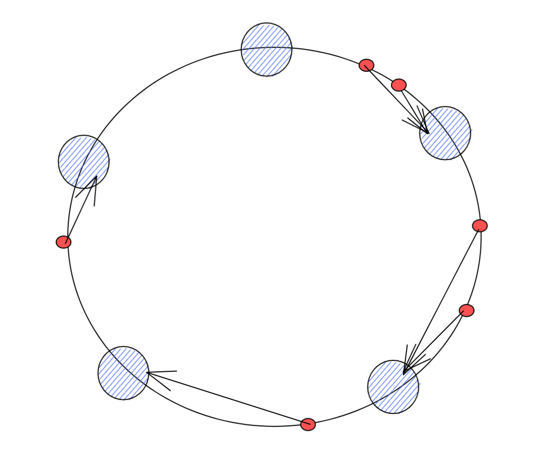
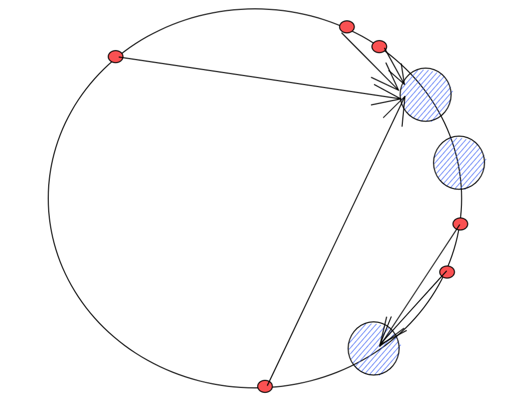
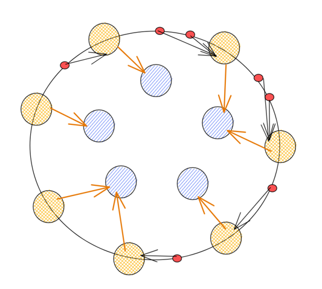

    # 一致性哈希
> 分布式系统中经常使用一致性哈希算法来实现数据分片和请求的负载均衡


## 数据结构与算法原理

一致性哈希算法原理：
一致性哈希算法使用取模（%）的方法，但不是对节点的数量进行取模，而是对 2^32 取模
 1. 将整个哈希值空间按照顺时针方向组织成一个虚拟的圆环，称为 Hash 环
> 2. 接着将各个节点使用 Hash 函数进行哈希，具体可以选择服务器的 IP 或主机名作为关键字来进行哈希，从而确定每台机器在哈希环上的位置
> 3. 最后使用算法定位数据访问到相应服务器：将请求的数据作为key使用相同的函数 Hash 计算出哈希值，并确定此数据在环上的位置，从此位置沿环顺时针寻找，第一台遇到的服务器就是其应该定位到的服务器



* 蓝色节点为实际服务器
* 红色的小点为请求ip映射到圆环上的位置
* 箭头指向表明当前请求会分配到那个服务器上去

但是这样会存在一个问题，在节点很少的情况下，可能会存在节点倾斜性问题，节点都分布在小部分区域，这样可能会导致大部分请求都打到一个节点上去了，不能雨露均沾。

类似这样，大部分请求都打到了一个节点上去了，其他节点没有请求或者请求很少，这样也达不到负载均衡或者数据分片的目的。


针对这种问题，一般可以通过增加虚拟节点来解决。 对每一个服务节点/grpc连接计算多个哈希，每个计算结果位置都放置一个此服务节点，称为虚拟节点，一个实际物理节点可以对应多个虚拟节点，虚拟节点越多，hash环上的节点就越多，缓存被均匀分布的概率就越大，hash环倾斜所带来的影响就越小。

效果如下：

* 蓝色节点为实际的物理节点
* 黄色节点为虚拟节点（可以发现，虚拟节点越多，环上的请求分配就会越平衡）
* 红色节点为实际的请求
* 一个真实节点对应多个虚拟节点，将虚拟节点的哈希值映射到环上，查询 key 的目标节点我们先查询虚拟节点再找到真实节点即可
* 相比于不增加虚拟节点，现在映射请求多了一步从虚拟节点再映射到实际节点这一步骤。


## go 语言实践
### 数据结构
基于上述理论，可以定义出下面这样的一致性哈希的数据结构。

```go

type ConsistentHash struct {
sync.RWMutex
hashFunc        Func
keys            slots             //虚拟节点列表，排序好的虚拟节点，便于通过二分算法快速定位到最近的物理节点
ring            map[uint64]Node   //虚拟节点到物理节点的映射
nodes           map[Node]struct{} //物理节点映射，判断当前物理节点是否存在
NumVirtualNodes int               // 为每台机器在hash圆环上创建多少个虚拟Node
	
}
```

### 算法原理
1. 查找
2. 生成hashkey
3. 找到hashkey对应的虚拟节点的位置
4. 二分查找虚拟节点对应的物理节点

```go

func (h *ConsistentHash) Get(key string) (Node, bool) {
	h.Lock()
	defer h.Unlock()
	if len(h.ring) == 0 || len(h.nodes) == 0 {
		return "", false
	}

	// 获取客户端地址的哈希值
	hashKey := h.hashFunc([]byte(key))
	//确定索引位置
	index := sort.Search(len(h.keys), func(i int) bool {
		return h.keys[i] >= hashKey
	}) % len(h.keys)

	//通过上述二分查找算法找到对应的物理节点
	node := h.ring[h.keys[index]]
	_, ok := h.nodes[node]
	return node, ok
}
```
2. 增加物理节点
```go
//Add ...
func (h *ConsistentHash) Add(node Node) {
	h.Lock()
	defer h.Unlock()
	// 为每台服务器生成数量为 replicateCount-1 个虚拟节点
	// 并将其与服务器的实际节点一同添加到哈希环中
	for i := 0; i < h.NumVirtualNodes; i++ {
		// 获取节点的哈希值，其中节点的字符串为 node+index
		hashkey := h.hashFunc([]byte(Key(node, i)))
		h.ring[hashkey] = node
		// 将节点的哈希值添加到哈希环中
		h.keys = append(h.keys, hashkey)
		h.nodes[node] = struct{}{}
	}
    //对虚拟节点的key进行排序
	sort.Sort(h.keys)
}
```
3. 移除物理节点
```go
//Remove ...
func (h *ConsistentHash) Remove(node Node) {
	h.Lock()
	defer h.Unlock()
	// 移除时需要将服务器的实际节点和虚拟节点一同移除
	for i := 0; i < h.NumVirtualNodes; i++ {
		// 计算节点的哈希值
		hashkey := h.hashFunc([]byte(Key(node, i)))

		//找到虚拟节点索引位置
		index := sort.Search(len(h.keys), func(i int) bool {
			return h.keys[i] >= hashkey
		})

		if index < len(h.keys) && h.keys[index] == hashkey {
			//移除index位置的元素
			h.keys = append(h.keys[:index], h.keys[index+1:]...)
		}
		// 移除虚拟节点到物理节点的映射关系
		delete(h.ring, hashkey)
	}
	//移除真实节点
	delete(h.nodes, node)
}
```


## 使用
使用起来就比较简单了，代码即文档，我写一个简单的测试用例来讲解该一致性哈希算法如何使用的
```go

func TestConsistentHash_Get(t *testing.T) {
	consistenhashIns := NewConsistentHash(6400, func(data []byte) uint64 {
		return murmur3.Sum64(data)
	})
	//添加物理节点
	consistenhashIns.Add("node-1")
	consistenhashIns.Add("node-2")
	consistenhashIns.Add("node-3")
	consistenhashIns.Add("node-4")
	consistenhashIns.Add("node-5")

	//测试请求
	for i := 0; i < 100; i++ {
		key := "request" + strconv.Itoa(i)
		node, ok := consistenhashIns.Get(key)
		t.Logf("当前请求：%s,哈希映射的物理节点:%s,%v", key, node, ok)
	}
	//移除node-1节点
	consistenhashIns.Remove("node-3")
	//再次测试请求
	t.Log("------second--------")
	for i := 0; i < 100; i++ {
		key := "request" + strconv.Itoa(i)
		node, ok := consistenhashIns.Get(key)
		t.Logf("当前请求：%s,哈希映射的物理节点:%s,%v", key, node, ok)
	}

}
```
其中，虚拟节点越大，请求分配越均匀，当然也符合我们的算法原理预期结果。
## 总结
以上就是一致性哈希算法的原理以及用 go 语言实现的代码及解析内容。引入虚拟节点的一致性哈希算法在节点分配上确实变得更加均匀了，可以避免，增加节点或者减少节点时，数据迁移带来的请求倾斜，以至于节点雪崩。

另外，一致性哈希算法还能够保证相同的请求会被映射到相同的节点上，也是其一个优点，可以被广泛用于数据分片功能，这样能够减少相同hash被随机映射的情况，便于实现数据的完备性，以及流量的切换等功能。