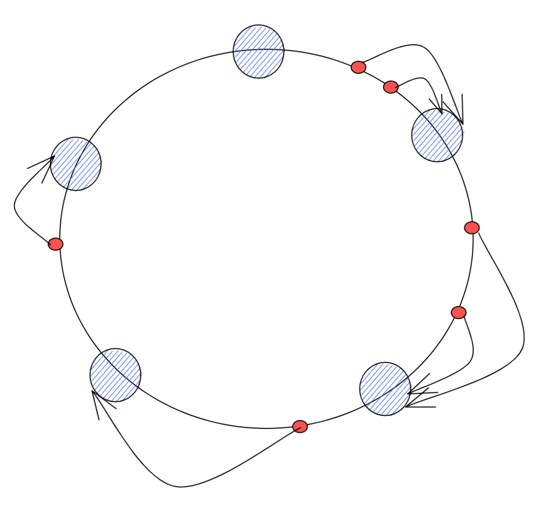
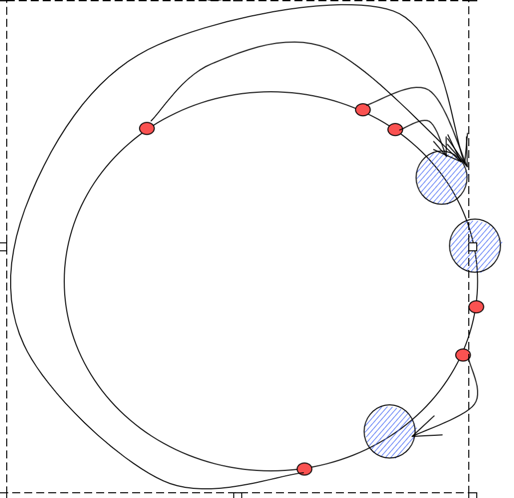

    # 一致性哈希
> 本文介绍如何基于一致性哈希来实现grpc的负载均衡

## 数据结构

一致性哈希算法原理：
> 一致性哈希算法使用取模的方法，但不是对节点的数量进行取模，而是对 2^32 取模
> 1. 将整个哈希值空间按照顺时针方向组织成一个虚拟的圆环，称为 Hash 环
> 2. 接着将各个节点使用 Hash 函数进行哈希，具体可以选择服务器的 IP 或主机名作为关键字进行哈希，从而确定每台机器在哈希环上的位置
> 3. 最后使用算法定位数据访问到相应服务器：将数据 key 使用相同的函数 Hash 计算出哈希值，并确定此数据在环上的位置，从此位置沿环顺时针寻找，第一台遇到的服务器就是其应该定位到的服务器



* 蓝色节点为实际服务器或者grpc连接
* 红色的小点为请求ip映射到圆环上的位置
* 箭头指向表明当前请求会分配到那个服务器/grpc连接上

但是这样会存在一个问题，在节点很少的情况下，可能会存在节点倾斜性问题，节点都分布在小部分区域，这样可能会导致大部分请求都打到一个节点上去了，不能雨露均沾。

类似这样：


针对这种问题，一般可以通过增加虚拟节点来解决。 对每一个服务节点/grpc连接计算多个哈希，每个计算结果位置都放置一个此服务节点，称为虚拟节点，一个实际物理节点可以对应多个虚拟节点，虚拟节点越多，hash环上的节点就越多，缓存被均匀分布的概率就越大，hash环倾斜所带来的影响就越小。

相比于不增加虚拟节点，现在映射请求多了一步从虚拟节点再映射到实际节点这一步骤。

下面我们就可以定义出一致性哈希的数据结构了。

```go

type ConsistentHash struct {
	
	
}
```

## 基本操作
* 哈希映射
* 添加节点
* 移除节点
* 查找节点