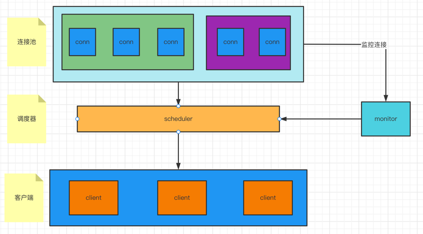

# 一个支持自动扩容缩容的 grpc 连接池的实现
> 最近在做某个系统的性能优化，由于在系统并发量这块的数据并不理想，排查最后发现，我们业务以来的底层架构大多是单连接形式的，即使很多服务都部署了多个副本，但上游业务层很多都是基于单一连接的，所以多副本部署仅仅增加了服务的可靠性，但在并发量比较大的时候，上游业务还是会响应不够快。
对于这种问题，有一个比较好的解决方案就是设计一个连接池来处理。下面我们就来看看如何实现一个go语言版本的 grpc 的连接池。

## 结构设计

一个连接池可以由如下几个参数构成：
1. 一个繁忙队列busy池
2. 一个空闲队列idle池
3. 相关配置参数
4. 相关调度器

架构设计如下：


## 功能设计：
1. 连接池的初始化：初始化连接池的相关参数，相关组件，并启动一个监控器，监控连接池的资源。
2. 连接的调度：连接池主要管理的是连接，那么对于连接的调度，连接的复用，自然就是最重要的了。主要原理如下
   1. 
3. 连接池资源的监控：第一步我们就需要启动一个这样的监控器，下面就看看这样的一个监控器要如何工作：
   1. 


一个完备的连接池大概就上述三点了，依据上述设计，下面带大家手撸一个简单的go语言版的tcp和grpc连接池：

## 代码实现
1. 数据结构设计
规划了两个对象：
   ```go
   //pool 内置pool对象，以插件化形式实现参数的注入
    type pool struct {
      
   }
   ```
```

2. 接口设计

接下来就开始编码了！


```